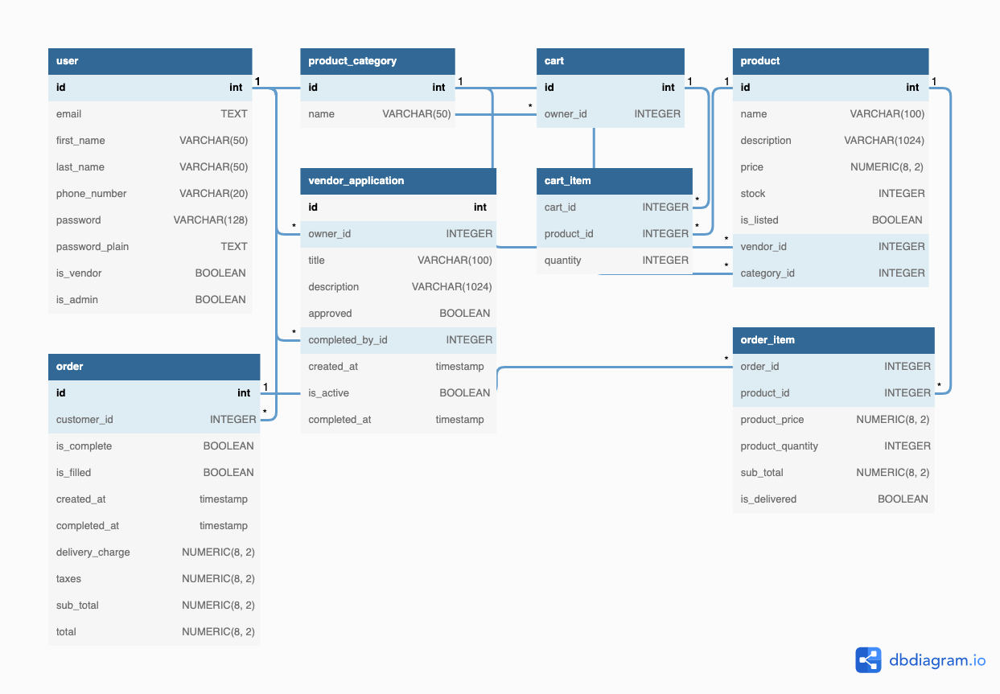
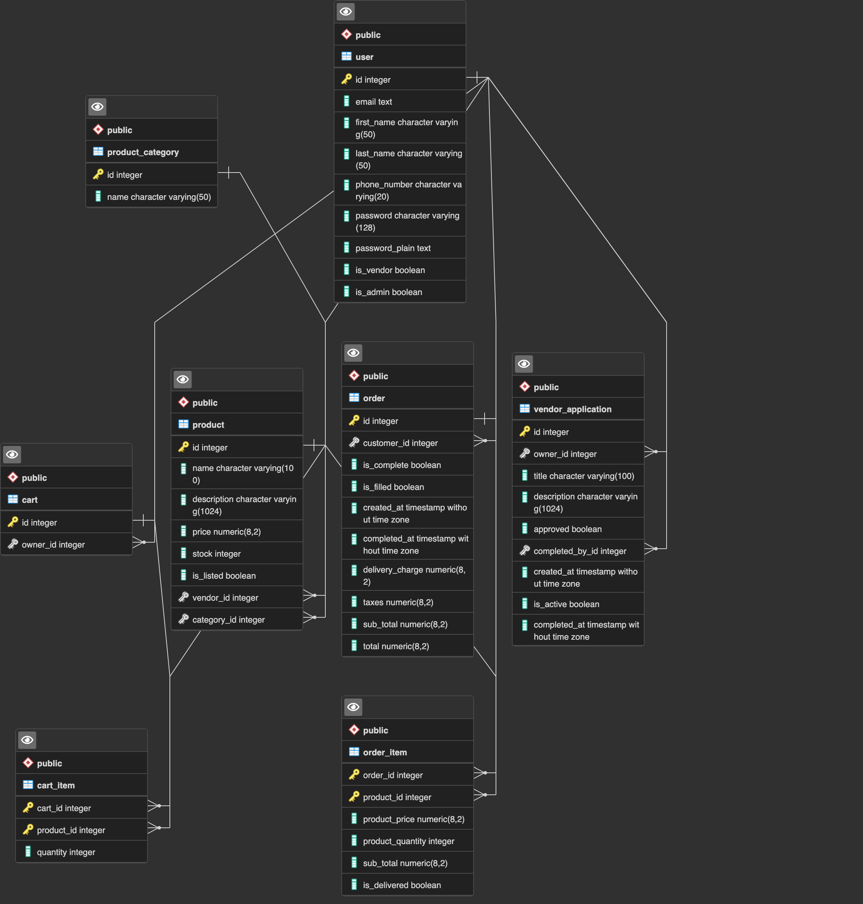

# shuBay

A product sales service system, much like eBay, where every user can be a vendor.

shuBay allows users to become vendors who can create/manage/sell products. Users can also buy products from vendors.

This project was created as a part of my final project for my DB class.

## Details & Features

shuBay comes with the following features:

- User registration
- User login
- Applying for vendor (as user)
- Creating, managing products (as vendor)
- Browsing products
- Adding products to cart
- Purchasing products (creates an order)
- Viewing past orders
- Completing requested orders (as vendor)
- Creating product categories (as admin)
- Managing vendors (as admin)
- Managing vendor applications (as admin)

## Schema Diagram



## ER Diagram



## Requirements

```
Python v3.7+
Pip for Python 3 (pip3)
```

## Installation

**IMPORTANT NOTE: PLEASE ENSURE THAT ANY SCRIPTS IN THE SCRIPTS FOLDER ARE 
EXECUTED FROM THE ROOT DIRECTORY OF THIS PROJECT. IF YOU RUN THESE SCRIPTS FROM THE SCRIPTS FOLDER, THIS WILL NOT WORK**

Install the dependencies for this project by using the following commands in the root directory of this project:

```
chmod a+x ./scripts/install.sh
./scripts/install.sh
```

Once installation is completed, please configure the environment variables (refer to the section below).

## Environment Variables

Environment variables must be in a `config.json` file in the root directory of the project with the following values:

```json
{
  "SECRET_KEY": "<RANDOM_CRYPTOGRAPHIC_SECRET>",
  "WTF_CSRF_SECRET_KEY": "<RANDOM_CRYPTOGRAPHIC_SECRET",
  "SQLALCHEMY_DATABASE_URI": "postgresql://user:password@ip:port/shuBay",
  "ADMIN_PASSWORD": "<STRONG_PASSWORD>",
  "SQLALCHEMY_TRACK_MODIFICATIONS": false,
  "SQLALCHEMY_ECHO": false
}
```

While `SQLALCHEMY_TRACK_MODIFICATIONS` should be set to false, you may set `SQLALCHEMY_ECHO` to true if you want to 
see all the queries that being executed by sqlalchemy. Sqlalchemy will log every query executed to the console in SQL
format.

## DB Initialization

Database tables must be initialized before this application can be used.

```
chmod a+x ./scripts/init.sh
```

This command also creates a default admin account (with password specific in config) along with some default product
categories.

## Usage

**NOTE**: Before running, please ensure that all values in the config file are filled out. 

You may run the application using the following commands at the root directory of this project, after which the project should be running on 
`http://127.0.0.1:5000`.

```
chmod a+x ./scripts/run.sh
# For Development
./scripts/run.sh dev
# For Production
./scripts/run.sh prod
```

## Adding/removing admin accounts

Admins can be manually added/removed by setting the is_admin value of a user to true/false.

This can also be done through the use of some custom scripts that are included with the application.

```
chmod a+x ./scripts/admin.sh
./scripts/admin.sh add <email>
./scripts/admin.sh revoke <email>
```

## Project Structure:

If you would like to understand the code for this project, please take 5-10 minutes to read this section.

This project's code has 5 main parts:

- Models
- Views
- Controllers
- Forms
- Services

### Models

Models define how a table should be created in a database. They are also used for performing CRUD operations on the DB.

Models can be found under packages (such as users, products, orders, etc.).

### Views

Views are what the user sees (HTML files). Views can be found in the templates folder.

### Controllers

Controllers handle the routing of the website. They handle http requests and execute business logic based on what route
invoked. 

For example, the auth controller has the routes login, logout, register, and change password. 
When a user visits /auth/login, the logic for handling user login is executed through the auth controller's login method.

Controller can be found under packages (such as auth, products, orders, etc.).

## Forms

Forms are created and validated (using python classes) in the backend. They are dynamically created on the front-end
based on all the specified fields that are provided in the class. Certain forms also handle some business logic
such as validating user credentials (see LoginForm in auth/forms.py).

Forms can be found under packages (such as auth, vendor etc.).

## Services

Services is where the core of the website's CRUD operations take place. Services use models to create, read, update, and
delete from the database. 

Services can be found under packages (such as users, vendor, products etc.).

